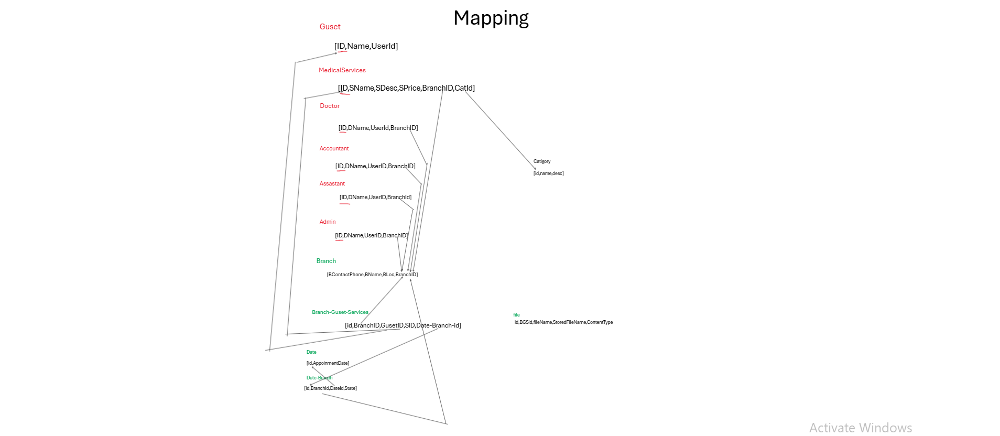

# MedicalServicesProject 🌡️

## 🌐 Live Demo - Try It Now!
➡️ **[http://medicalservices.runasp.net/](http://medicalservices.runasp.net/)**  
*(Test credentials available upon request)*

---

A **secure, role-based** web application for multi-branch medical service bookings with full-featured dashboards for different user roles.


## 🔥 Key Features

- **Role-Based Access Control** (6 distinct roles)
- **Multi-Branch Management**
- **Real-Time Appointment System**
- **Interactive Dashboards**
- **Secure Authentication**

## 🛠 Tech Stack

### Frontend  


### Backend  


### Database  


### Architecture  


---

## 🗄 Database Design

### Entity Relationship Diagram (ERD)
  
*Visualizes all tables with relationships and constraints*

### ORM Mapping
  
*Entity Framework Core code-first implementation*

---

## 🚀 Getting Started

```bash
# Clone repository
git clone https://github.com/your-username/MedicalServicesProject.git

# Restore packages
dotnet restore

# Run application
dotnet run
