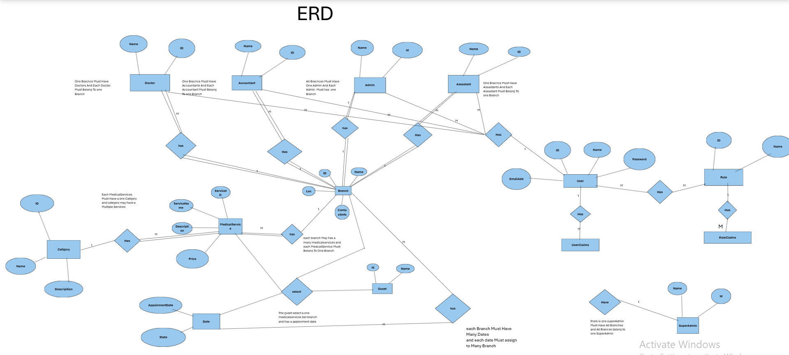

# MedicalServicesProject 🌡️

A **secure, role-based** web application for multi-branch medical service bookings with full-featured dashboards for different user roles.


## 🔥 Key Features

- **Role-Based Access Control** (6 distinct roles)
- **Multi-Branch Management**
- **Real-Time Appointment System**
- **Interactive Dashboards**
- **Secure Authentication**
- **JSON Document Storage** (EF Core 8)
- **Hierarchical Data Support**

## 🛠 Tech Stack

### Frontend  


### Backend  


### Database  


### Architecture  


---

## 🚀 New in This Version

- **SQL Server 2022** with enhanced performance and security
- **Entity Framework Core 8** with:
  - Improved JSON column support
  - Better hierarchical data handling
  - Enhanced LINQ translation
- **Modernized data access patterns**
- **Optimized query performance**

---

## 🌐 Live Demo

➡️ [http://medicalservices.runasp.net/](http://medicalservices.runasp.net/)  
*(Test credentials available upon request)*

---

## 🗄 Database Design

### Entity Relationship Diagram (ERD)
  
*Visualizes all tables with relationships and constraints*

### ORM Mapping
  
*Entity Framework Core 8 code-first implementation with SQL Server 2022*

---

## 🛠 Getting Started

```bash
# Clone repository
git clone https://github.com/your-username/MedicalServicesProject.git

# Restore packages
dotnet restore

# Apply migrations (requires SQL Server 2022)
dotnet ef database update

# Run application
dotnet run
